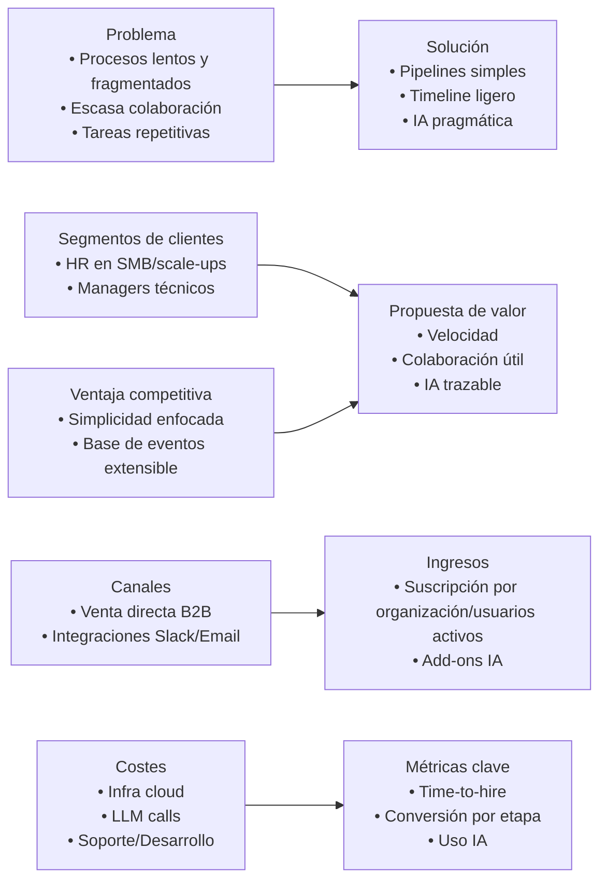
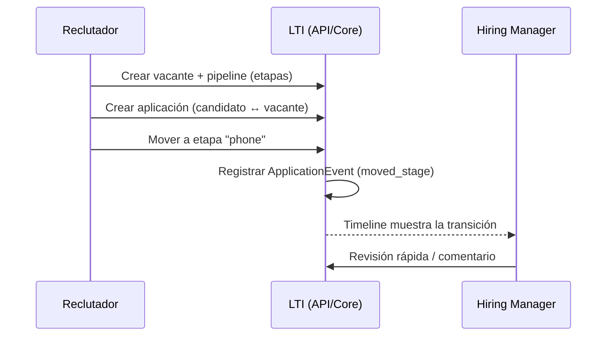
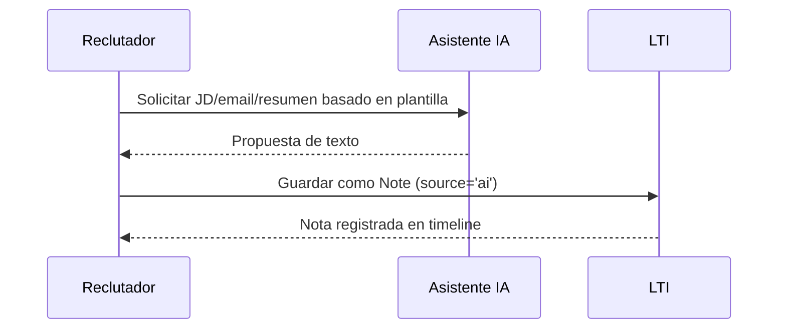
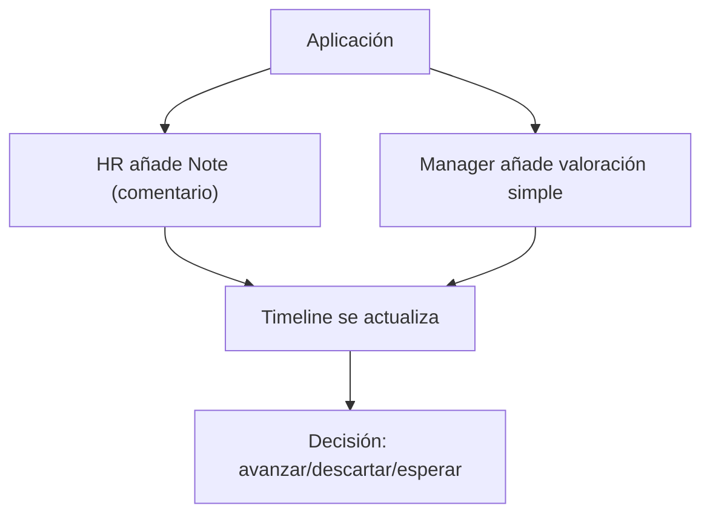
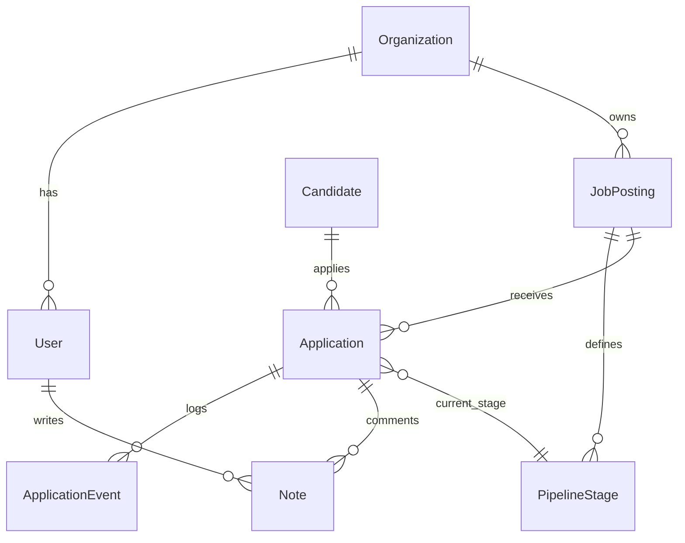
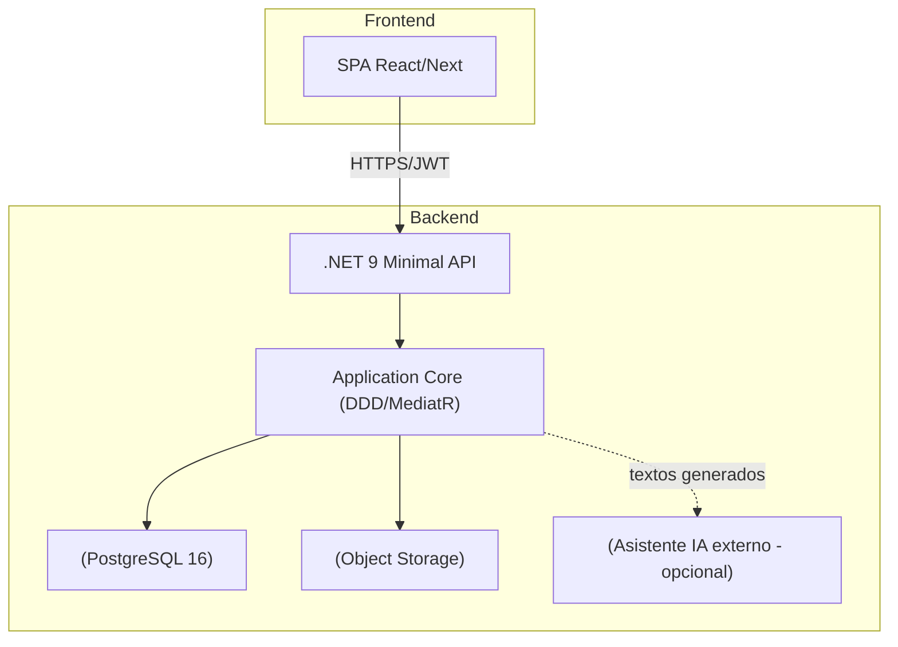
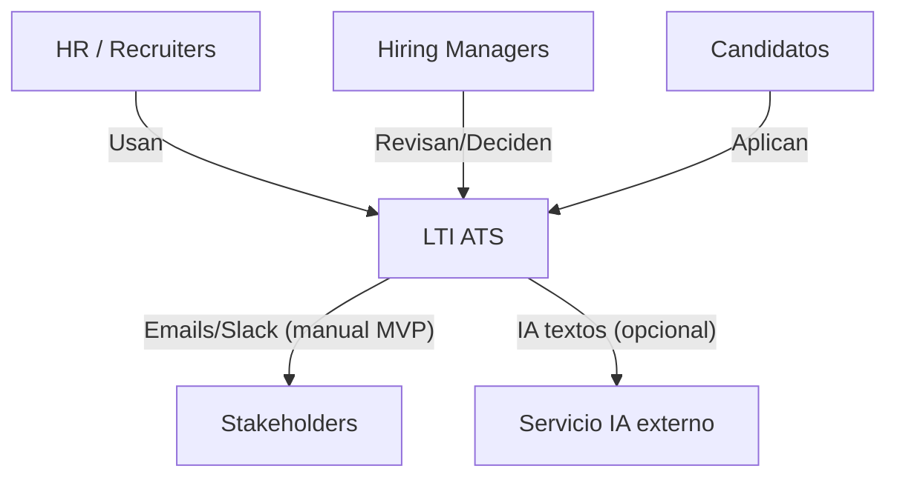
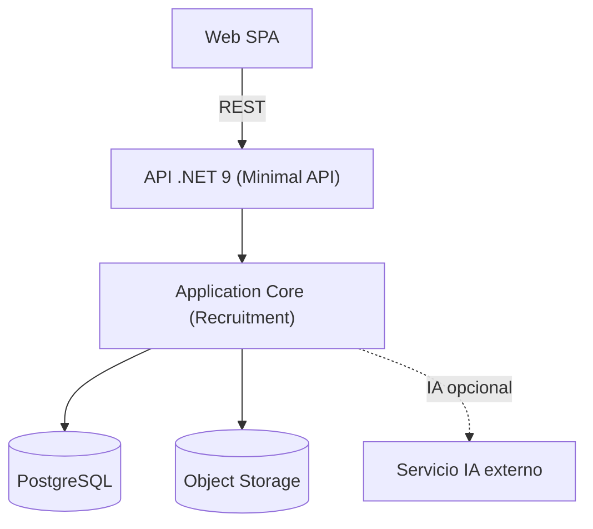
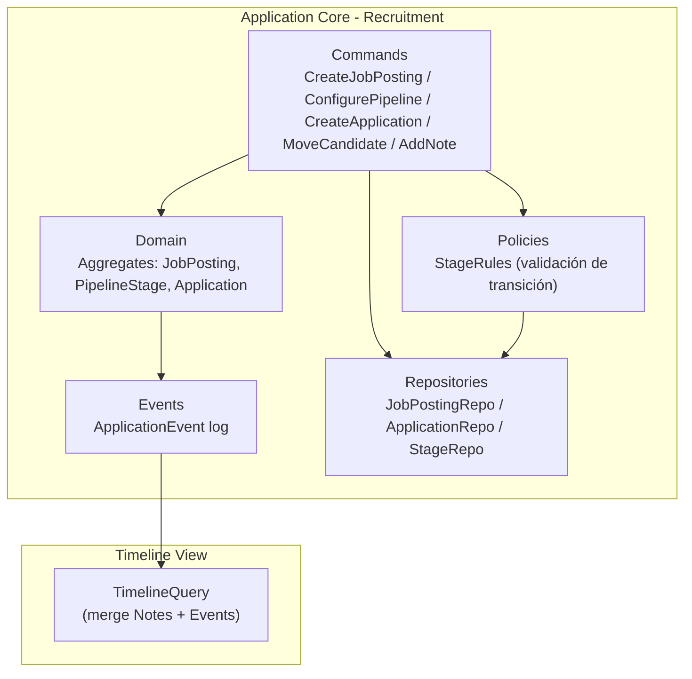

# Entrega

## LTI — ATS de nueva generación (Documento MVP)

> **Rol:** Arquitecto de Producto y Software Senior
> **Objetivo:** Entrega ejecutiva-técnica del MVP de LTI (ATS inteligente) con visión de producto, funciones, modelo de negocio, modelo de datos, diseño del sistema y C4 (profundizando en un componente).

---

## A. Descripción breve del software LTI

### ¿Qué es LTI?

LTI es un **Applicant Tracking System (ATS)** de nueva generación que combina **pipelines inteligentes**, **colaboración ligera** y **asistencia de IA** para acelerar y mejorar la toma de decisiones en reclutamiento.

### Problema que resuelve**

* Procesos lentos e inconsistentes entre HR y managers.
* Falta de visibilidad en el estado real de las vacantes.
* Tareas administrativas repetitivas que consumen tiempo (emails, resúmenes, publicaciones).

### Propuesta de valor (MVP)

* **Velocidad operativa**: mover candidatos por etapas con un click y auditar el proceso con un timeline simple.
* **Colaboración mínima y útil**: notas y valoraciones integradas en cada aplicación.
* **IA pragmática**: generación de textos (JD, resúmenes, emails) con trazabilidad simple.

### Ventajas competitivas

* **Simplicidad enfocada al “time-to-hire”**: modelo de datos y UI centrados en el pipeline, no en la plataforma.
* **Escalabilidad sin rehacer**: base de eventos ligera (`ApplicationEvent`) que permite crecer hacia reglas, notificaciones y feed avanzado.
* **Arquitectura pragmática**: monolito modular (.NET 9) + PostgreSQL listo para evolucionar a colas/servicios cuando el uso lo requiera.

---

## B. Funciones principales (MVP)

| Módulo                   | Funcionalidad                                                                           | Beneficio                         |
| ------------------------ | --------------------------------------------------------------------------------------- | --------------------------------- |
| **Gestión de Vacantes**  | Crear/editar vacantes, publicar, estados (draft/open/on_hold/closed)                    | Control y visibilidad de demanda  |
| **Pipelines Simples**    | Etapas por vacante, orden y tipo (screen/phone/tech/onsite/offer)                       | Flujo estándar y medible          |
| **Aplicaciones**         | Asociar candidato↔vacante, mover entre etapas, estado (active/hired/rejected/withdrawn) | Orquestación del proceso          |
| **Timeline (ligero)**    | Registro de eventos (applied, moved_stage, note, interview, scored)                     | Auditoría y métricas              |
| **Notas & Valoraciones** | Comentarios por aplicación; “source=ai” para textos generados                           | Colaboración y trazabilidad de IA |
| **Búsqueda/Filtrado**    | Por vacante, etapa, estado                                                              | Enfoque en priorización diaria    |

---

## C. Lean Canvas (MVP)

> Representación esquemática en diagrama + tabla resumen.

### Tabla resumen

| Bloque             | Contenido                                           |
| ------------------ | --------------------------------------------------- |
| Problema           | Procesos lentos, poca coordinación, tareas manuales |
| Segmentos          | HR en SMB/scale-ups y managers técnicos             |
| Propuesta de valor | Velocidad, colaboración útil, IA trazable           |
| Solución           | Pipeline simple + timeline + notas + IA textual     |
| Canales            | Directo B2B, partners/integraciones                 |
| Ingresos           | Suscripción y add-ons de IA                         |
| Costes             | Infra, LLM, soporte y desarrollo                    |
| Métricas           | Time-to-hire, conversión por etapa, uso IA          |
| Ventaja            | Simplicidad + base extensible por eventos           |

---

## D. Casos de uso principales (MVP)

### 1) **Gestionar pipeline y mover candidatos**

**Objetivo:** orquestar el proceso por etapas con trazabilidad mínima.
**Actores:** Reclutador, Hiring Manager, Sistema.
**Flujo principal:** crear vacante → definir etapas → crear aplicación → mover entre etapas → auditar en timeline.
**Valor:** velocidad y consistencia; métricas de conversión por etapa.

---

### 2) **IA para artefactos (JD / email / resumen)**

**Objetivo:** acelerar la creación de textos con trazabilidad simple.
**Actores:** Reclutador, Sistema de IA (asistente).
**Flujo principal:** invocar IA → generar texto → revisar/editar → guardar como nota (`source='ai'`).
**Valor:** reducción de tiempo operativo, consistencia.

---

### 3) **Colaboración mínima en la aplicación (notas/valoraciones)**

**Objetivo:** centralizar comentarios y valoraciones por aplicación.
**Actores:** HR, Hiring Manager.
**Flujo principal:** añadir notas/valoraciones → timeline muestra eventos → decidir siguiente paso.
**Valor:** menos reuniones, decisiones más rápidas.

---

## E. Modelo de datos (MVP)

**Principios:** 8 tablas core; auditoría ligera por evento; IA como texto.
**Entidades y atributos (nombre y tipo):**

### Organization

* `OrganizationId: uuid (PK)`
* `Name: text`
* `CreatedAt: timestamptz`

### User

* `UserId: uuid (PK)`
* `OrganizationId: uuid (FK → Organization)`
* `Email: text (UNIQUE)`
* `FullName: text`
* `Role: text ('recruiter'|'hiring_manager'|'admin')`
* `Active: bool`
* `CreatedAt: timestamptz`

### JobPosting

* `JobPostingId: uuid (PK)`
* `OrganizationId: uuid (FK → Organization)`
* `Title: text`
* `Description: text`
* `Seniority: text`
* `Status: text ('draft'|'open'|'on_hold'|'closed')`
* `CreatedBy: uuid (FK → User)`
* `CreatedAt: timestamptz`
* `PublishedAt: timestamptz?`

### PipelineStage

* `StageId: uuid (PK)`
* `JobPostingId: uuid (FK → JobPosting)`
* `Name: text`
* `Kind: text ('screen'|'phone'|'tech'|'onsite'|'offer'|'rejected')`
* `OrderIndex: int`

### Candidate

* `CandidateId: uuid (PK)`
* `FullName: text`
* `Email: text`
* `Phone: text?`
* `Location: text?`
* `CreatedAt: timestamptz`

### Application

* `ApplicationId: uuid (PK)`
* `CandidateId: uuid (FK → Candidate)`
* `JobPostingId: uuid (FK → JobPosting)`
* `CurrentStageId: uuid? (FK → PipelineStage)`
* `Status: text ('active'|'hired'|'rejected'|'withdrawn')`
* `Source: text?`
* `CreatedAt: timestamptz`

### ApplicationEvent

* `EventId: uuid (PK)`
* `ApplicationId: uuid (FK → Application)`
* `Type: text ('applied'|'moved_stage'|'note'|'interview'|'scored'|'status_changed')`
* `FromStageId: uuid? (FK → PipelineStage)`
* `ToStageId: uuid? (FK → PipelineStage)`
* `Payload: jsonb?`
* `CreatedBy: uuid? (FK → User)`
* `OccurredAt: timestamptz`

### Note

* `NoteId: uuid (PK)`
* `ApplicationId: uuid (FK → Application)`
* `AuthorId: uuid (FK → User)`
* `Source: text ('user'|'ai')`
* `Body: text`
* `CreatedAt: timestamptz`

**Diagrama ER (Mermaid):**

---

## F. Diseño del sistema (alto nivel)

**Arquitectura (MVP):** monolito modular en **.NET 9 (Minimal API)** con **PostgreSQL** y **Storage de objetos** para adjuntos.
**Comunicación:** REST + JWT; versionado vía `x-api-version`.
**Observabilidad:** OpenTelemetry; errores en `ProblemDetails`.
**Integraciones (MVP):** Email/Slack manuales (sin colas), IA como servicio externo opcional (solo para generar texto).

**Diagrama (Mermaid):**

### Estrategia de despliegue y evolución

* MVP sin colas ni workers.
* Cuando sea necesario: **Outbox + Worker** para notificaciones/reglas; mínima migración.
* Separar *bounded contexts* por módulos internos (Recruitment, Collaboration).

---

## G. Diagrama C4 — Profundizando en **Smart Pipelines & Timeline**

### C4 — **C1: Contexto**

**Descripción:** LTI es el sistema central para gestionar vacantes, candidatos y decisiones; los candidatos interactúan a través de formularios o carga manual por HR.

---

### C4 — **C2: Contenedores**

**Descripción:**

* **API/BFF** expone endpoints CRUD y comandos de movimiento de etapa.
* **Core** implementa casos de uso (`CreateJobPosting`, `ConfigurePipeline`, `CreateApplication`, `MoveCandidate`, `AddNote`).
* **Repo** guarda el estado; **ApplicationEvent** sirve para timeline/métricas.

---

### C4 — **C3: Componentes internos (Smart Pipelines & Timeline)**

**Explicación:**

* **Commands** encapsulan casos de uso básicos.
* **Policies** validan transiciones (p.ej., no saltar etapas críticas si así se define).
* **Events** persiste `ApplicationEvent` en cada acción relevante; **TimelineQuery** compone la vista (eventos + notas) para UI.
* El diseño permite añadir **Automation/Notificaciones** más adelante consumiendo `ApplicationEvent` sin reescribir el core.

---

## H. Casos de uso **opcionales** (post-MVP)

| Caso                                                            | Descripción                                      | Motivo de aplazamiento                                | Por qué no generará deuda                                                                     |
| :-------------------------------------------------------------- | :----------------------------------------------- | :---------------------------------------------------- | :-------------------------------------------------------------------------------------------- |
| **Automatización de reglas (OnStageEnter/Leave)**               | Definir acciones automáticas al mover candidatos | Incrementa complejidad y requiere motor de colas      | `ApplicationEvent` permite añadir `AutomationWorker` sin modificar el dominio                 |
| **Feed colaborativo avanzado (comentarios, reacciones, hilos)** | Timeline social tipo Slack                       | No aporta aprendizaje temprano                        | Puede construirse sobre `ApplicationEvent` y `Note`, añadiendo entidad `Reaction` sin ruptura |
| **Programación de entrevistas sincronizada con calendarios**    | Integración con Google/Microsoft Calendar        | Depende de APIs externas y gestión OAuth              | MVP usa `ApplicationEvent(type='interview')`, ampliable con `external_event_id`               |
| **Evaluaciones formales (scorecards)**                          | Valoración estructurada por dimensiones          | Necesita UI avanzada y esquema flexible               | MVP usa `ApplicationEvent(type='scored')`, luego se migra a `Evaluation`                      |
| **Notificaciones automáticas (email/Slack)**                    | Worker que escucha eventos y envía mensajes      | Añade infraestructura no necesaria para validar valor | `ApplicationEvent` sirve de *trigger source* para añadir worker asíncrono                     |
| **Dashboard de analítica avanzada**                             | Métricas agregadas y visuales                    | Requiere masa crítica de datos                        | MVP ya registra métricas crudas en `ApplicationEvent`, exportables más adelante               |

**Conclusión sobre postergación:**
Cada caso aplazado responde a **criterios Lean**: no es necesario para validar la propuesta de valor principal.
Además, todos los diferidos se apoyan en **entidades persistentes ya existentes (ApplicationEvent y Note)**, garantizando que **no habrá migraciones dolorosas** ni ruptura de contratos al extender el sistema.

## I. Conclusión

El **MVP de LTI** prioriza **rapidez y trazabilidad mínima** para validar el core del reclutamiento: **vacantes, pipeline, aplicaciones, timeline y notas**. La arquitectura es **simple y extensible**: el **modelo de datos de 8 tablas** y la **base de eventos** permiten:

* **Medir lo importante** (time-to-hire, conversiones por etapa).
* **Acelerar decisiones** con colaboración mínima pero efectiva.
* **Escalar gradualmente** hacia reglas, notificaciones, entrevista/calendario e IA estructurada **sin rehacer**.

**Coherencia general:**
El diseño equilibra **viabilidad técnica, escalabilidad futura y foco de negocio**. El MVP no elimina complejidad: la pospone conscientemente para validar hipótesis antes de invertir en infraestructura.

**Sostenibilidad:**

* Arquitectura modular, preparada para crecer en vertical (más features) y horizontal (más organizaciones).
* Modelo de datos estable y extensible.
* Implementación sencilla de métricas y trazabilidad.

**Visión:**
LTI transforma el ATS tradicional en una herramienta **operativa, colaborativa y adaptativa**.
Este MVP es **suficiente para aprender, medir y evolucionar** sin deuda técnica ni refactor costoso.
